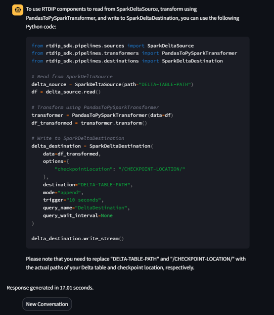
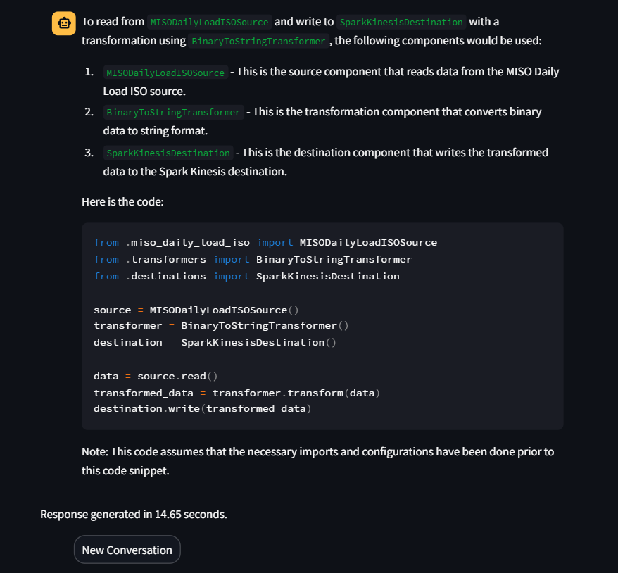
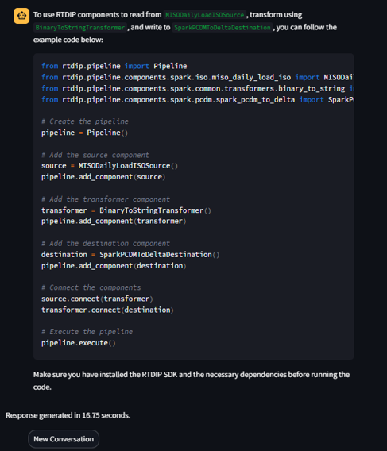

# Tests Results for Solution 2 :

As a team, we decided to experiment with the merge retriever concept, reasoning that using two retrievers instead of one might yield superior results.
### For a detailed breakdown of my specific contributions to this task, please refer to the "feature/improve_the_content_store" branch, as these changes may not be merged into the main branch.

Notably,  I integrated LanceDB as our primary retriever, replacing Chroma in our combination with FAiss. This shift was based on insights gathered from GitHub discussions, which indicated that Chroma was not as effective in a merged context.

However, an unexpected outcome arose with the Lotr implementation. Contrary to our goals, after merging the two retrievers, Lotr did not return any codes, which was not the intended behavior, as evident from the attached screenshot.

Moving forward, I decided to focus only on LanceDB. Given our extensive experience with Faiss and the previous shift to Chroma (which initially showed improved results), exploring LanceDB exclusively seemed a rational step.

And to thoroughly evaluate this approach (LanceDB + the newly implemented RAG) against our previous setup (Chroma + the newly implemented RAG), I  conducted a series of  queries on the second Solution . And my teammate "Obeidah" will give the results of queries of the first solution (using the same queries).
This comparative analysis will help us to take the decision (which approach we will present) . Below, I will share my personal insights on these findings the queries and the results obtained.

## My personal insights on these findings :
The results with LanceDB combined with the new RAG were disappointing. Contrary to expectations, this pairing did not enhance our bot's performance. In contrast, the Chroma and new RAG duo showed promising results previously. Based on these observations, I  that we should present the Chroma-enhanced RAG solution, as it clearly aligns better with our objectives.However, we will finalize this decision in our upcoming meeting (before our team meeting).

## Queries and Results :
Query 68: I would like to use RTDIP components to read from PythonDeltaSource, transform using PandasToPySparkTransformer, then write to PythonDeltaDestination

Query 228: I would like to use RTDIP components to read from PythonDeltaSharingSource, transform using EdgeXOPCUAJsonToPCDMTransformer, then write to SparkKinesisDestination

Query 663: I would like to use RTDIP components to read from SparkDeltaSource, transform using PandasToPySparkTransformer, then write to SparkDeltaDestination

Query 689: I would like to use RTDIP components to read from SparkDeltaSource, transform using PySparkToPandasTransformer, then write to SparkKafkaEventhubDestination

Query 1205: I would like to use RTDIP components to read from SparkIoThubSource, transform using BinaryToStringTransformer, then write to SparkKafkaDestination

Query 2397: I would like to use RTDIP components to read from MISODailyLoadISOSource, transform using BinaryToStringTransformer, then write to SparkPCDMToDeltaDestination

Query 3435: I would like to use RTDIP components to read from SparkWeatherCompanyForecastAPIV1Source, transform using PandasToPySparkTransformer, then write to SparkDeltaDestination

